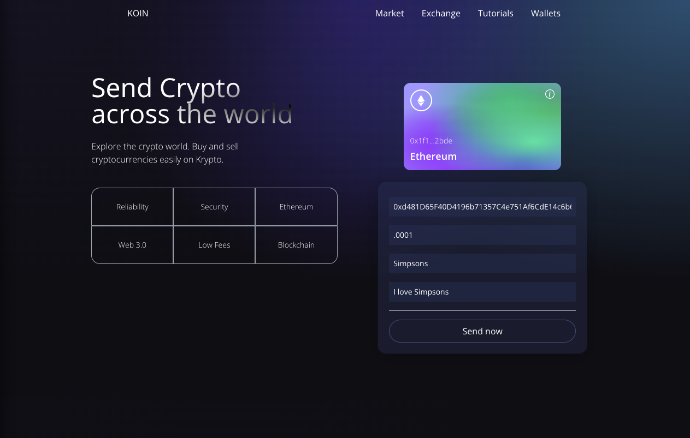

# Koin, a Web3.0 app

This is my first web app where a user can connect a metamask wallet and send ethereum to a wallet address (🚧 updates coming soon)

[Live Preview](https://web3-0-app.vercel.app/)

- [Overview](#overview)
  - [Introduction](#introduction)
- [Built with](#built-with)
- [What I Learned](#what-i-learned)
- [Useful Resources](#useful-resources)
- [Author](#author)

## Overview 

### Introduction 👋

This is a basic Web3.0 app where users can connect their metamask wallet and send ETH to another address. You can see transactions made on the website with a gif based off the entered keyword

## Built with 🛠

* React
* TailwindCSS
* Solidity

### Technologies

* Solidity
* TailwindCSS
* Vite
* Hardhat
* Ether

### Tools

* Metamask
* Visual Studio Code
* Terminal
* Git and GitHub
* GiphyAPI

## What I learned 🎓

* Basic Solidity and smart contracts
* TailwindCSS
* Connecting a smart contract program with the frontend
* Git rebase

## Useful Resources 📖

## Author

👤 **Manik Rana**
* GitHub: [Maniktherana](https://github.com/Maniktherana)